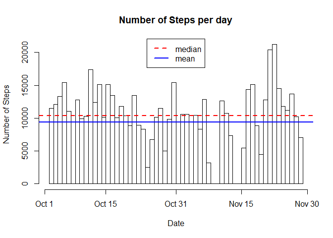
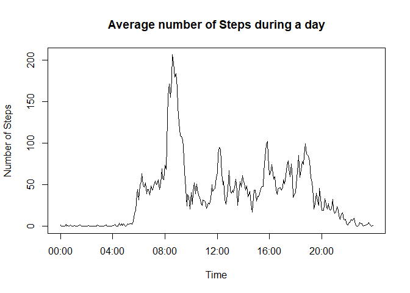
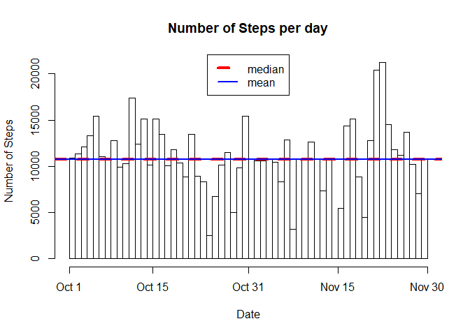
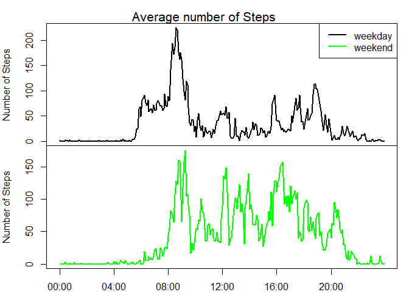

This assignment makes use of data from a personal activity monitoring device. This device collects data at 5 minute intervals through out the day. The data consists of two months of data from an anonymous individual collected during the months of October and November, 2012 and include the number of steps taken in 5 minute intervals each day.

### Loading and preprocessing the data
First we will start with reading the data and doing some processing to properly create date and time columns.

```r
library(data.table)

data<-read.csv("activity.csv")
data$date<-as.Date(as.character(data$date))
```


### What is mean total number of steps taken per day?
Next we will calculate the total number of steps taken per day as shown in the below histogram.

```r
StDay<-with(data,tapply(steps,date,sum,na.rm=TRUE))
StDayMean<-round(mean(StDay))
StDayMedian<-median(StDay)
x<-NULL
    for (i in 1:length(StDay)){x<-c(x,rep(as.Date(names(StDay)[i]),times=StDay[i]))}
hist(x,xaxt="n",breaks=61,xlab="Date",ylab="Number of Steps",main="Number of Steps per day")
axis(1,at=c(15614,15628,15644,15659,15674),label=c("Oct 1","Oct 15","Oct 31","Nov 15","Nov 30"))
abline(h=StDayMedian,lwd=2,lty=2,col="red")
abline(h=StDayMean,lwd=2,col="blue")
legend("top",lwd=rep(2,2),lty=c(2,1),legend=c("median","mean"),col=c("red","blue"))
```

<!-- -->

As can be seen the number of steps taken per day has a mean of 9354 steps and median of 10395 steps


### What is the average daily activity pattern?
Next we will calculate the total number of steps taken per day as shown in the below histogram.

```r
StInt<-tapply(data$steps,data$interval,mean,na.rm=TRUE)
MaxInt<-names(which.max(StInt))
MaxIntHr<-floor(as.numeric(MaxInt)/100)
MaxIntMin<-as.numeric(MaxInt)-MaxIntHr*100
MaxInt<- as.character(as.ITime(MaxIntHr*3600+MaxIntMin*60))
intervals<-seq(0,24*3600-300,length=length(StInt))
plot(intervals,StInt,type="l",xaxt="n",xlab="Time",ylab="Number of Steps",main="Average number of Steps during a day")
axis(1,at=c(0,14400,28800,43200,57600,72000),label=c("00:00","04:00","08:00","12:00","16:00","20:00"))
```

<!-- -->

As shown in the graph the interval 08:35:00 witnesses the maximum number of steps.


### Imputing missing values
In this part we will attempt to impure the missing values from the data which represents a relatively big portion.

```r
Missing<-sum(is.na(data$steps))
```
There are 2304 values in our data set. They will be replaced with the mean of the same time interval from ther days.

```r
MissingData<-data[is.na(data$steps),]
for (i in 1:length(StInt)){
    MissingData[MissingData$interval==as.numeric(names(StInt)[i]),]$steps<-StInt[i]
}
FilledData<-data
FilledData[is.na(FilledData$steps),]<-MissingData
```

To check the impact of this imputing we will reconstruct the histogram above after the filling.


```r
StDay2<-with(FilledData,tapply(steps,date,sum))
StDayMean2<-round(mean(StDay2))
StDayMedian2<-median(StDay2)
x2<-NULL
    for (i in 1:length(StDay2)){x2<-c(x2,rep(as.Date(names(StDay2)[i]),times=StDay2[i]))}
hist(x2,xaxt="n",breaks=61,xlab="Date",ylab="Number of Steps",main="Number of Steps per day")
axis(1,at=c(15614,15628,15644,15659,15674),label=c("Oct 1","Oct 15","Oct 31","Nov 15","Nov 30"))
abline(h=StDayMedian2,lwd=4,lty=2,col="red")
abline(h=StDayMean2,lwd=2,col="blue")
legend("top",lwd=c(4,2),lty=c(2,1),legend=c("median","mean"),col=c("red","blue"))
```

<!-- -->

As can be seen the mean and median number of steps taken per day have increased to 10766 steps and 10766.1886792453 steps respectively because we added steps that were previously considered zeros.

### Are there differences in activity patterns between weekdays and weekends?
Finally, we will compare activity during weekdays vs during weekend.
For that we will need to create a factor vector to determine each date whether it is a weekday or weekend.


```r
days<-weekdays(data$date)
data$dayID[days %in% c("Monday","Tuesday","Wednesday","Thursday","Firday")]<-"weekday"
data$dayID[days %in% c("Saturday","Sunday")]<-"weekend"
StIntWD<-tapply(data[data$dayID=="weekday",]$steps,data[data$dayID=="weekday",]$interval,mean,na.rm=TRUE)
StIntWE<-tapply(data[data$dayID=="weekend",]$steps,data[data$dayID=="weekend",]$interval,mean,na.rm=TRUE)
par(mfrow=c(2,1),mar=c(0,4,0,1),oma=c(2,0,2,0))
plot(intervals,StIntWD,type="l",xaxt="n",ylab="Number of Steps",lwd=2)
legend("topright",lwd=c(2,2),col=c("black","green"),legend=c("weekday","weekend"))
plot(intervals,StIntWE,type="l",xaxt="n",xlab="Time",ylab="Number of Steps",lwd=2,col="green")
mtext("Average number of Steps",cex=1.3,outer=TRUE)
axis(1,at=c(0,14400,28800,43200,57600,72000),label=c("00:00","04:00","08:00","12:00","16:00","20:00"))
```

<!-- -->
